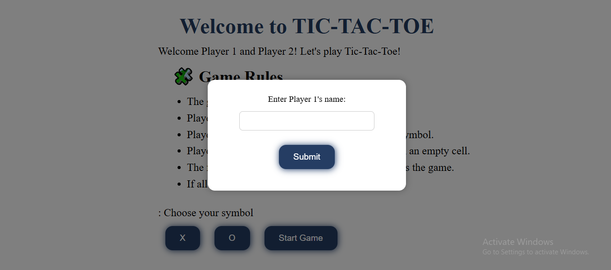
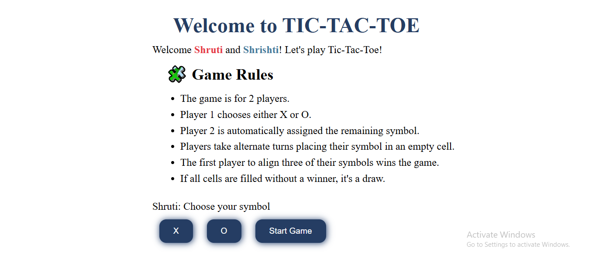
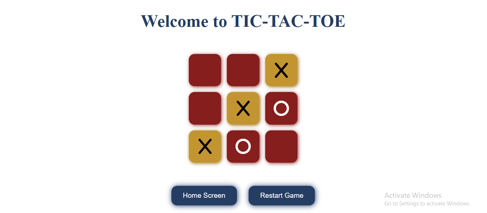

# 🎮 Tic-Tac-Toe Game

A fully interactive and visually styled **Tic-Tac-Toe (X & O)** game built using **vanilla JavaScript**, **HTML**. This version includes sound effects, hover animations, custom prompts, alerts, and support for 2 players with personalized names.

---

## ✨ Features

- 🧍‍♂️ 2-player mode with custom names
- ❓ Custom `prompt()` and `alert()` dialog boxes (centered on screen)
- 🎨 Fully styled interface (buttons, grid, text)
- 🖱️ Interactive cell hover effects
- ✅ Win detection with highlighted cells
- ⚠️ Draw detection
- 🔊 Sound effects for clicks, wins, and draws
- 🔁 Restart Game and ⬅️ Home Screen buttons
- 🎯 Symbol selection by Player 1 (X or O)
- 🎮 Cursor label showing the current player's name

---

## 📸 Preview

| Main Screen | Main Screen | Game Screen |
|--------------|-------------|----------------|
|  |  |  |


---

## 📁 Project Structure

```
tic-tac-toe/
│
├── index.html # Main HTML file
├── script.js # Contains all JavaScript code
├── sounds/
│ ├── click.mp3
│ ├── clapping.mp3
│ └── failed.mp3
└── README.md # Project documentation
```
## 🚀 How to Run

1. Clone or download the repository.
2. Open `index.html` in your browser (or embed script in your page).
3. Play!

---

## 🔧 Customization

- 🎨 You can change the styles of the grid, buttons, and background directly in `script.js` or via `styles.css` if you extract it.
- 🧑‍🎤 Replace sound files (`click.mp3`, `clapping.mp3`, `failed.mp3`) in the `sounds/` folder for a personalized experience.

---

## 🧠 Concepts Covered

- DOM Manipulation
- Event Handling
- CSS-in-JS styling
- Game state management
- Conditional rendering
- Callback-based prompts
- Custom overlay modals

---

## 💡 Future Improvements

- Add AI (Computer vs Player)
- Add a score counter
- Make it mobile responsive
- Save last winner using `localStorage`

---

## Author

Created by **Shruti Chandra** as a part of a JavaScript learning journey.

---

## 📄 License

This project is open-source and free to use for educational purposes.

